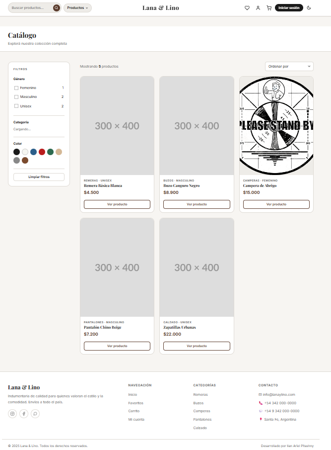
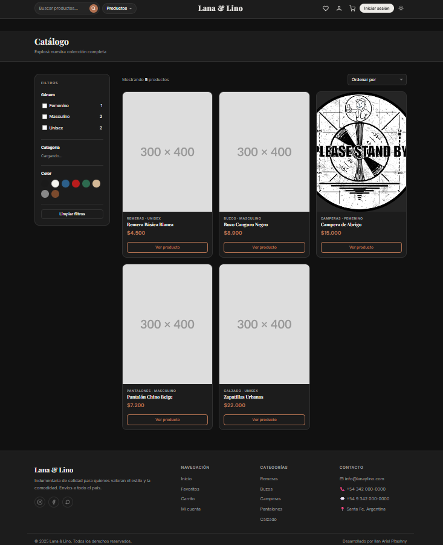
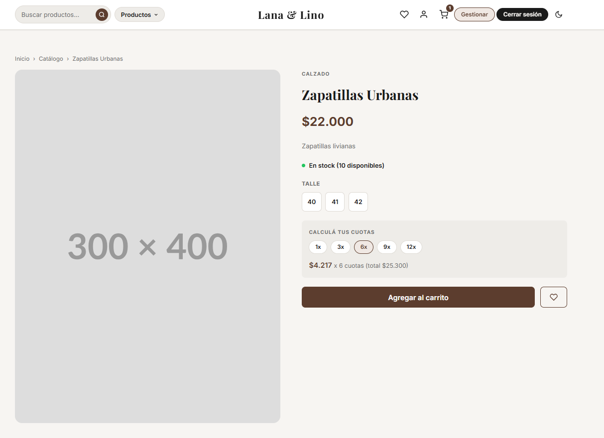
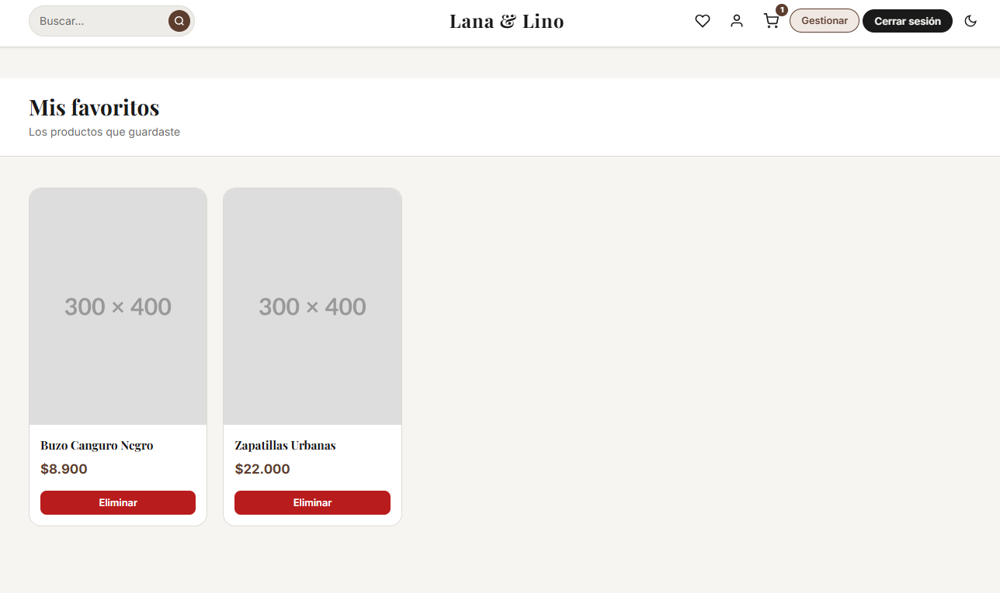
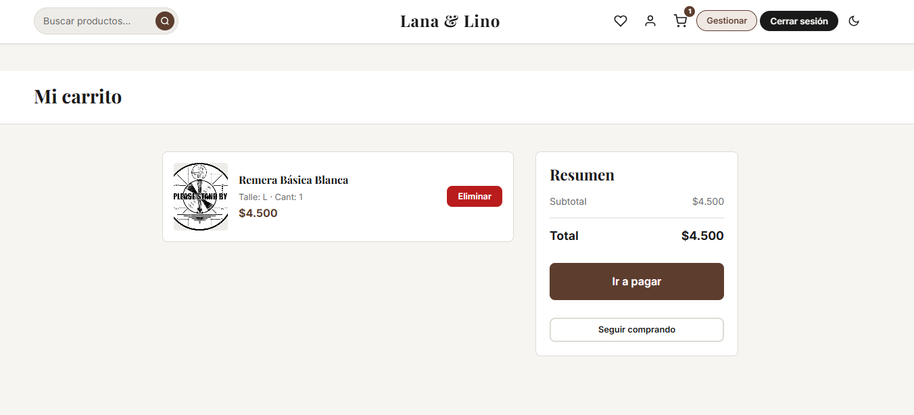
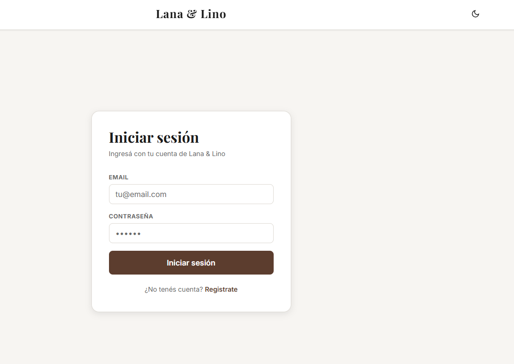
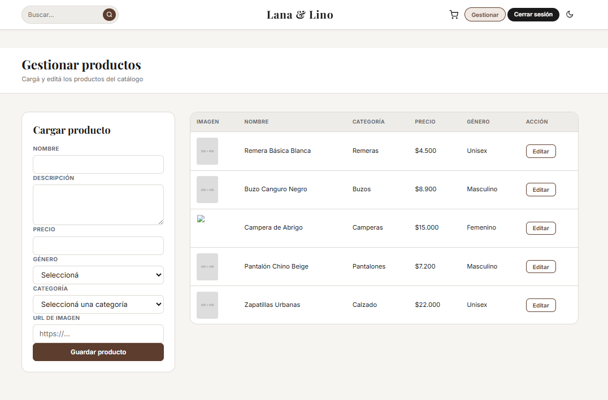

# TP1-Prog2-Pitashny

Aplicación web para la venta de indumentaria de la empresa ficcional **Lana & Lino**.
Trabajo Práctico N°1 — Programación 2 — 2026.

---

## Integrante

**Ilan Ariel Pitashny**

---

## Tecnologías utilizadas

- HTML5 semántico
- CSS3 con variables y modo oscuro nativo
- JavaScript Vanilla (sin frameworks)
- Backend Node.js + Express proporcionado por la cátedra
- Base de datos MariaDB (XAMPP)

---

## Funcionalidades

- Catálogo de productos con cards, filtros por género, categoría y color
- Buscador de productos por nombre
- Detalle de producto con talles, stock, y calculadora de cuotas (1, 3, 6, 9, 12)
- Login y registro de usuarios
- Carrito de compras con eliminación de ítems
- Pantalla de pago con validación de datos de tarjeta
- Sección de favoritos con agregar/eliminar
- Perfil de usuario con modificación de datos
- Panel de administrador para cargar y editar productos
- Modo claro / modo oscuro con persistencia en localStorage
- Control de permisos por rol (no logueado, usuario, administrador)

---

## Modificación al backend

Se agregó el paquete `cors` al backend de la cátedra y se habilitó en `src/app.js`.

Esto fue necesario porque el frontend corre en un origen distinto al backend
(`http://127.0.0.1:5500` vs `http://localhost:4000`), y el navegador bloquea
las peticiones entre orígenes distintos si el servidor no lo permite explícitamente.
Sin este cambio, ninguna llamada a la API funcionaba desde el frontend.

El único cambio realizado fue:

```js
import cors from "cors";
app.use(cors());
```

Y la instalación del paquete:

```bash
npm install cors
```

No se modificó ninguna otra parte del backend.

---

## Limitaciones conocidas

La consigna solicita que el administrador pueda modificar los datos de un producto
(nombre, descripción, precio, género, categoría, imagen). Sin embargo, el backend
proporcionado por la cátedra no expone ningún endpoint para esta operación.

El único endpoint de modificación disponible es `PUT /modificarStock`, que solo
permite actualizar el stock del inventario.

Por este motivo, el botón "Editar" en el panel de administración precarga los datos
del producto en el formulario, pero al guardar genera un producto nuevo en lugar de
modificar el existente.

## Estructura del proyecto

```
frontend/
├── index.html          ← Catálogo principal
├── producto.html       ← Detalle de producto
├── login.html          ← Iniciar sesión
├── registro.html       ← Crear cuenta
├── carrito.html        ← Carrito de compras
├── pago.html           ← Pantalla de pago
├── favoritos.html      ← Productos favoritos
├── perfil.html         ← Datos del usuario
├── admin.html          ← Panel administrador
├── css/
│   ├── base.css        ← Variables, reset, componentes globales
│   ├── header.css      ← Estilos del header
│   ├── footer.css      ← Estilos del footer
│   ├── productos.css   ← Catálogo, cards y detalle
│   └── forms.css       ← Login, registro, carrito, pago, admin
└── js/
    ├── api.js          ← Módulo de conexión con el backend
    ├── header.js       ← Modo oscuro, sesión, dropdown
    ├── productos.js    ← Lógica del catálogo y filtros
    ├── producto.js     ← Lógica del detalle de producto
    ├── auth.js         ← Login y registro
    └── app.js          ← Carrito, pago, favoritos, perfil, admin
```

---

## Instrucciones para ejecutar el proyecto

### 1 — Levantar la base de datos

- Encender XAMPP y asegurarse de que MySQL esté corriendo
- Abrir phpMyAdmin (`http://localhost/phpmyadmin`)
- Crear una base de datos llamada `lanaylino` con cotejamiento `utf8_general_ci`
- Importar el archivo `lanaylino.sql` provisto por la cátedra

### 2 — Configurar el backend

Crear el archivo `.env` en la raíz del backend con:

```
HOST=localhost
DATABASE=lanaylino
USER=root
PASSWORD=
SECRET=Programacion21erC2025
```

### 3 — Levantar el backend

```bash
npm install
npm run dev
```

El backend corre en `http://localhost:4000`

### 4 — Abrir el frontend

Abrir la carpeta `frontend` en VS Code e instalar la extensión **Live Server** (Ritwick Dey).
Clic derecho en `index.html` → **Open with Live Server**.

Se abre en `http://127.0.0.1:5500`

> ⚠️ No abrir `index.html` con doble clic — el CORS va a bloquear todas las peticiones al backend.

---

## Crear un usuario administrador

La base de datos no incluye usuarios por defecto. Para crear un administrador,
ejecutar el siguiente SQL en phpMyAdmin luego de importar la base:

```sql
INSERT INTO usuario (nombre, apellido, email, password, rol)
VALUES ('Admin', 'Lana', 'admin@lanaylino.com', 'admin123', 'administrador');
```

Con esas credenciales se puede iniciar sesión y acceder al panel de gestión de productos.

---

## Capturas de pantalla









---

## Créditos

- Backend: Federico Gauchat — Programación 2, IES Santa Fe
- Frontend: Ilan Ariel Pitashny